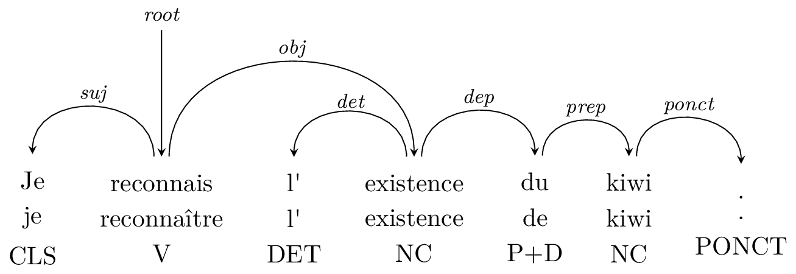

Ginger
======

[](https://pypi.org/project/gingertree)
[](https://github.com/LoicGrobol/ginger/actions?query=workflow%3ACI)
[](https://github.com/psf/black)

Format conversion and graphical representation of [Universal Dependencies](http://universaldependencies.org) trees.



```text
│
│          ┌─────────────┐
│┌────────┐│             │
││        ││             │┌─────────┐    ┌────┐
││    ┌───│┤         ┌───│┤         │┌──┐│    │
↓│    ↓   ↓│         ↓   ↓│         ↓│  ↓│    ↓
ROOT  Je  reconnais  l'  existence  du  kiwi  .
```

## Installation

First install [Pycairo's dependencies](https://pycairo.readthedocs.io/en/latest/getting_started.html).

If you use Windows, [Pycairo won't install
automatically](https://github.com/pygobject/pycairo/issues/19) anyway but you can install it
manually from [the unoficial wheels](https://www.lfd.uci.edu/~gohlke/pythonlibs/#pycairo).

If you can't or don't want to install Pycairo on your system, skip this and omit \[images\] extras
in the following step.

Install ginger from [Pypi](https://pypi.org/manage/project/gingertree)<a id="footnote-0-1-backref"
href="#footnote-0-1">¹</a>

```console
python3 -m pip install gingertree[images]
```

(Either with `--user` or in a virtualenv but you knew that already, didn't you?)

You can also install it directly from the tip (unstable but usually safe) of the master branch whith

```console
python3 -m pip install git+https://github.com/LoicGrobol/ginger/[images]
```

Test if everything works by running `ginger examples/test.conll`.
The output should be the same as the ASCII-art tree above.

---

<sub><a href="#footnote-0-1-backref">↑</a><a id="footnote-0-1">1.</a> It's `gingertree` because
`ginger` is being squatted ☹ if you know how to fix that, please let me know.</sub>

## Usage

```console
ginger [--from <format>] <in-file> [--to] [<out-file>]
```

### Arguments

- `<in-file>`   input file (in CoNLL-U format), `-` for standard input
- `<out-file>`  output file, `-` for standard input (default: `-`)

### Options

- `-f`, `--from <format>` input file format, see below (default: `guess`)
- `-t`, `--to <format>`   output file format, see below (default: `ascii`)
- `-h`, `--help` Get some help

### Examples

- Print to stdout
  
  ```console
  ginger examples/test.conll
  ```

- Assume CoNLL-X for input format
  
  ```console
  ginger -f conllx spam.conllx
  ```

- Output TikZ code
  
  ```console
  ginger examples/test.conll -t tikz
  ```

- Print to a file

  ```console
  ginger examples/test.conll examples/output.asciiart
  ```

- Pipe in and out
  
  ```console
  cat examples/test.conll | ginger - | less
  ```


### Input formats

- `guess` Try to guess the file format, defaults to CoNLL-U

#### CoNLL

- `conllu` [CoNLL-U v2 format](http://universaldependencies.org/format.html)
- `conllx` [CoNLL-X format](https://web.archive.org/web/20160814191537/http://ilk.uvt.nl:80/conll/)
- `conll2009_gold`  [CoNLL-2009 format](http://ufal.mff.cuni.cz/conll2009-st/task-description.html)
  - Takes only the gold columns into account.
  - The P- and -PRED attributes are preserved in the `misc` attribute of the
    intermediate CoNLL-U tree.
- `conll2009_sys`  [CoNLL-2009 format](http://ufal.mff.cuni.cz/conll2009-st/task-description.html)
  - Takes only the predicted columns into account.
  - The gold columns and the -PRED attributes are preserved in the `misc` attribute of the
    intermediate CoNLL-U tree.

#### Software

Formats used by mainstream NLP tools

- `talismane`  Outputs of
  [Talismane](http://redac.univ-tlse2.fr/applications/talismane/talismane_en.html)
- `mate_gold` Input/Output of
  [mate-tools](http://www.ims.uni-stuttgart.de/forschung/ressourcen/werkzeuge/matetools.en.html)
  (actually an alias for `conll2009_gold`)
- `mate_sys` Input/Output of
  [mate-tools](http://www.ims.uni-stuttgart.de/forschung/ressourcen/werkzeuge/matetools.en.html)
  (actually an alias for `conll2009_sys`)

### Output formats

#### Treebanks

The input must be either the path to an existing file or `-` for standard input. The data that
it contains must be in one of the following formats:

- `guess`           Try to guess the file format, defaults to CoNLL-U
- `conllx`          [CoNLL-X format][2]
- `conllu`          [CoNLL-U format][3]
- `conll2009_gold`  [CoNLL-2009 format][4] (Gold columns only)
- `conll2009_sys`   [CoNLL-2009 format][4] (Predicted columns only)
- `talismane`       Outputs of [Talismane][5]
- `mate_gold`       Alias for `conll2009_gold`, used by [mate-tools][1]
- `mate_sys`        Alias for `conll2009_sys`, used by [mate-tools][1]

**Note**: no real effort is made to preserve informations that are not relevant to Universal
Dependencies, so this might be information-destructive, e.g. if converting from CoNLL-2009 to
itself, the P- attributes will be dropped.

#### Text formats

To use these formats, the output destination must be either a file and thus must not be the path to
an existing directory, or `-` for the standard output.

- `ascii`  ASCII-art (using unicode characters, because, yes, we are subversive)
- `tikz`   TikZ code. Use the `positioning`, `calc` and `shapes.multipart` tikz libraries
  - The output is only the `\tikzpicture` part, not a whole compilable document, there is
  [an example](examples/tree.tex) of such a document in `example`.
  - The code is quite verbose since we chose to rely on TikZ' own arithmetic capabilities in
  order to allow easier edition and reuse of the generated code.

### Image formats

To use these formats, the output destination must be either a directory and thus must not be the
path of an existing file, or `-` for the standard output, in which case the byte streams
corresponding to different trees will be separated by NULL bytes.

- `png`
- `svg`
- `pdf`

[1]: http://www.ims.uni-stuttgart.de/forschung/ressourcen/werkzeuge/matetools.en.html
[2]: https://web.archive.org/web/20160814191537/http://ilk.uvt.nl:80/conll/
[3]: http://universaldependencies.org/format.html
[4]: http://ufal.mff.cuni.cz/conll2009-st/task-description.html
[5]: http://redac.univ-tlse2.fr/applications/talismane/talismane_en.html
[6]: http://universaldependencies.org

## Development

Development and releases on [Github](https://github.com/loic-grobol/ginger).

## Further notes

- When importing non-CoNLL-U treebanks, node forms with spaces are considered to be fixed
  expressions, and are treated according to the [UD
  guidelines](http://universaldependencies.org/u/dep/fixed.html) by splitting them in single-token
  nodes linked by `fixed` dependencies This mean that the exceptions mentioned in [the UDv2
  guidelines](http://universaldependencies.org/v2/segmentation.html) are not supported for those
  imports. They are supported when importing from CoNLL-U, though.

## License

This licence (the so-called “MIT License”) applies to all the files in this repository.
See also [LICENSE.md](LICENSE.md).

```text
Copyright 2019 Loïc Grobol <loic.grobol@gmail.com>

Permission is hereby granted, free of charge, to any person obtaining a copy of this software and
associated documentation files (the "Software"), to deal in the Software without restriction,
including without limitation the rights to use, copy, modify, merge, publish, distribute,
sublicense, and/or sell copies of the Software, and to permit persons to whom the Software is
furnished to do so, subject to the following conditions:

The above copyright notice and this permission notice shall be included in all copies or
substantial portions of the Software.

THE SOFTWARE IS PROVIDED "AS IS", WITHOUT WARRANTY OF ANY KIND, EXPRESS OR IMPLIED, INCLUDING BUT
NOT LIMITED TO THE WARRANTIES OF MERCHANTABILITY, FITNESS FOR A PARTICULAR PURPOSE AND
NONINFRINGEMENT. IN NO EVENT SHALL THE AUTHORS OR COPYRIGHT HOLDERS BE LIABLE FOR ANY CLAIM,
DAMAGES OR OTHER LIABILITY, WHETHER IN AN ACTION OF CONTRACT, TORT OR OTHERWISE, ARISING FROM, OUT
OF OR IN CONNECTION WITH THE SOFTWARE OR THE USE OR OTHER DEALINGS IN THE SOFTWARE.
```
